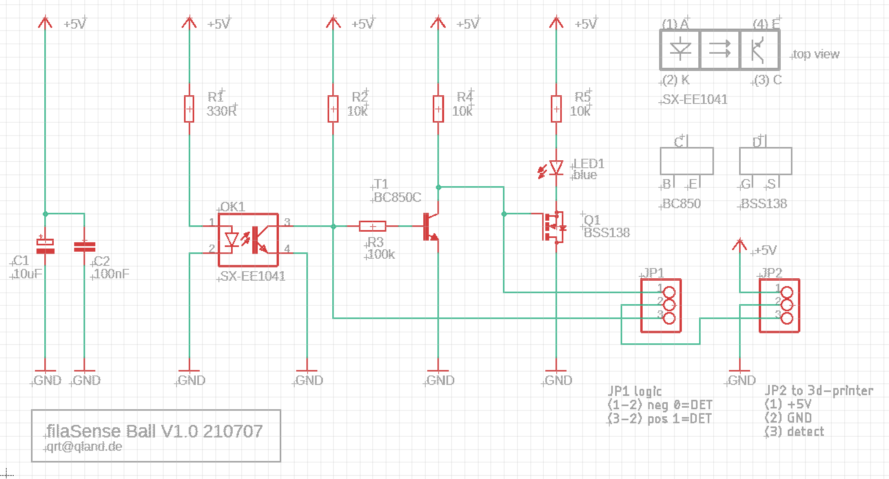

# **Filament Runout Sensor with Steel Ball**

Frictionless, reliable and simple filament runout detection.

 

## Operation
A steel ball drops into a light barrier if filament is running out. To reload filament a magnet is used to move the steel ball above the filament. 

### LED
The filament state is indicated by a LED
- **on**  
loaded
- **off**  
runout

 

---

 

## Views

### Mounted sensor

 
 

### Slightly tilted
to follow filament tension the sensor can be tilted, if smoothly printed a tilt angel up to 85 degree is possible   

 
 

### Mounting bracket
a mounting bracket allows adjusting tilt and top angle   

 
 

### Steel ball and Light barrier

 
 

## Renders

### Front

 
 

### Side

 
 

### Light barrier cut in half

 
 

### Steel ball above filament

 
 

### Steel ball dropped

 
 

## Schematic

 
 

 
 

---

[qrt@qland.de](mailto:qrt@qland.de) 210706
